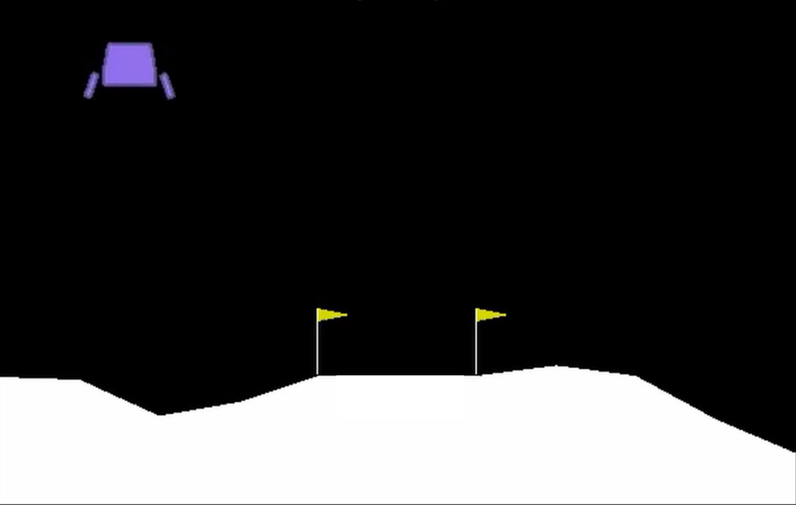
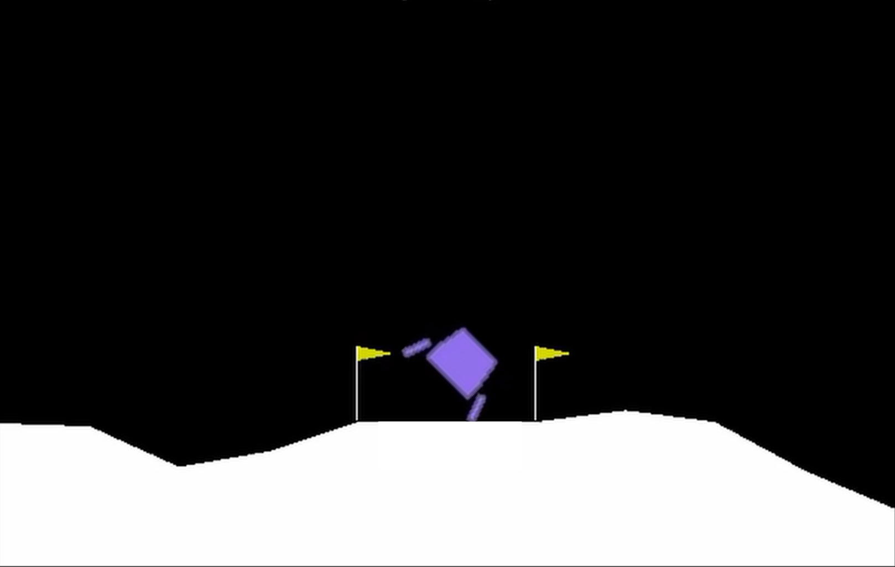
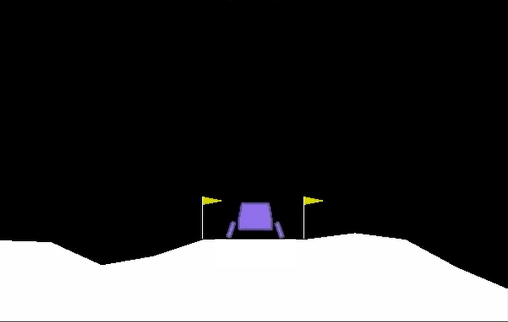
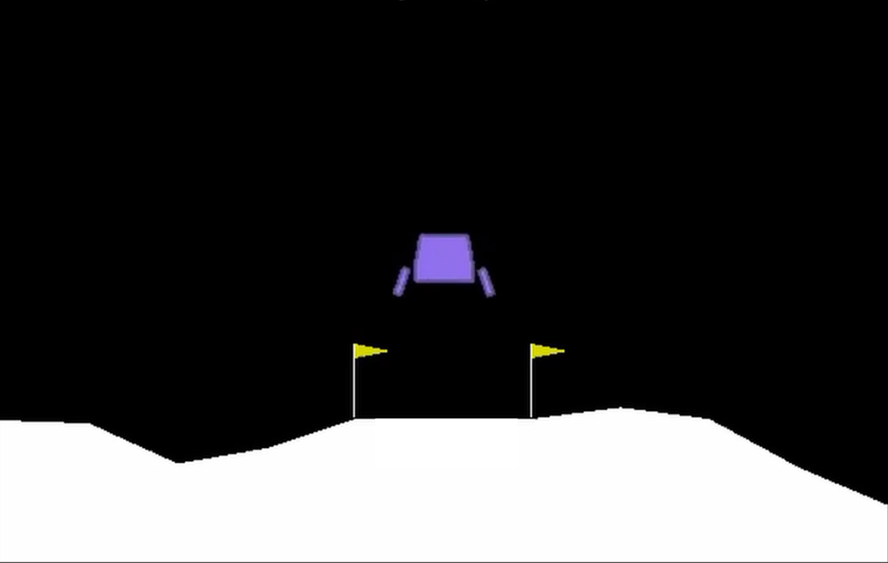
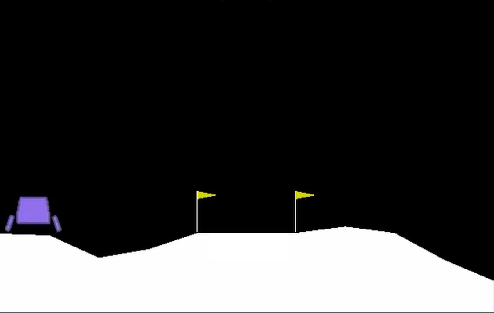
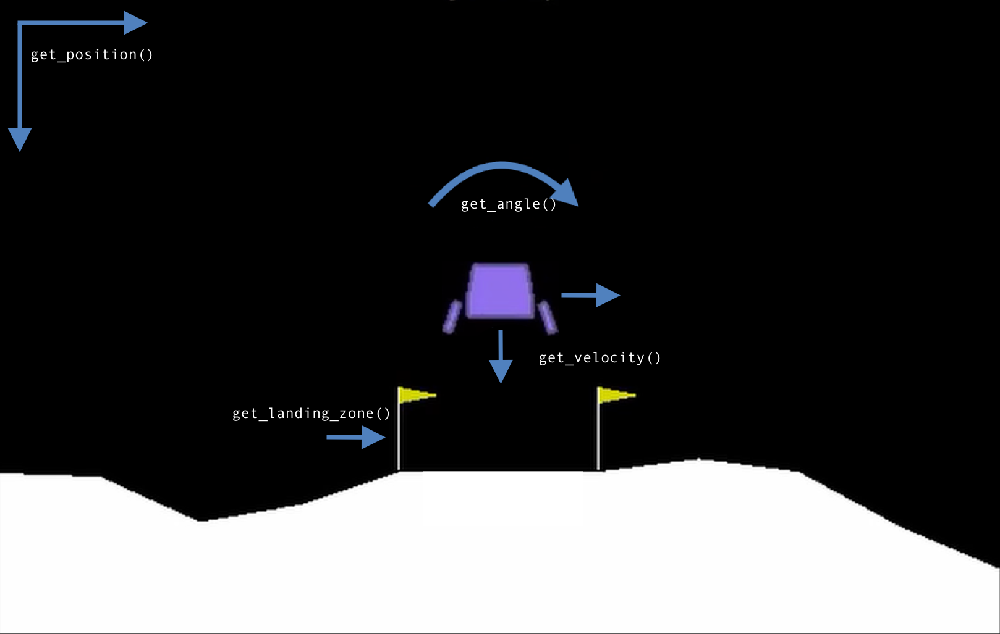

# Reinforcement Learning for GNC Guidance, Navigation, and Control

This project aims to achieve a lunar landing using **reinforcement learning** in place of traditional aerospace methods. Since real-world rocket training isn’t practical, the focus is on creating a **realistic simulator** to mimic the environment. The process involves building the simulator, selecting an effective algorithm, and optimizing hyperparameters, starting with a lunar lander environment.

---

## Lunar Lander Progression

  
  
  
  
  
  

---

## Table of Contents
1. [Environment Design](#environment-design)
2. [Agent Implementation](#agent-implementation)
3. [Parameter Study](#parameter-study)

---

## Environment Design

- **Creating the Reward Function**: 
  - The reward function for the lunar lander environment considers conditions such as landing speed, angle, fuel consumption, and proximity to the landing zone. 
  - The lander will crash under conditions of excessive downward or horizontal speed, an off-vertical angle at touchdown, fuel depletion, or landing outside a specified range of the target zone. 
  - The reward function also incentivizes **fuel conservation**.

- **Qualitative Evaluation of the Reward Function**: 
  - While quantitative evaluation metrics aren’t provided, the effectiveness of the reward function can be judged qualitatively by running a series of test cases. 
  - Assess whether the reward function's responses are reasonable based on desired lander behavior. 
  - The focus is on designing a reward structure that aligns with **safe** and **cost-effective** landing criteria.

---

## Agent Implementation

- **Action-Value Network**: 
  - The agent uses a neural network to estimate action values (Q-values) for different state-action pairs, allowing it to predict the long-term reward associated with each action in a given state.

- **Adam Optimizer**: 
  - This optimization algorithm updates the neural network's weights efficiently by adapting the learning rate for each parameter. 
  - It helps the agent learn from its experiences by minimizing the loss in predicted action values.

- **Experience Replay Buffers**: 
  - This mechanism stores past experiences (state, action, reward, next state) and samples them randomly during training. 
  - It helps the agent learn more robustly by reducing correlation between consecutive experiences.

- **Softmax Policy**: 
  - This policy helps the agent choose actions based on the probability distribution generated by the action-value network, balancing exploration and exploitation by selecting actions with higher estimated rewards more frequently.

- **Running the Experiment**: 
  - All components are combined to train the agent within the environment, enabling it to interact with the lunar lander, update the Q-values using the Adam optimizer, sample from the replay buffer, and make decisions based on the softmax policy. 
  - This loop continues until the agent learns an effective policy for landing.

---

## Parameter Study

- **Script for Performance Evaluation**: 
  - Create a script that runs the agent and environment across different parameter settings to evaluate performance under varying conditions.

- **Step-Size Sensitivity Analysis**: 
  - Analyze the impact of the step-size parameter on the agent's performance by plotting a parameter sensitivity curve, providing insights into how this parameter influences learning outcomes.

---
